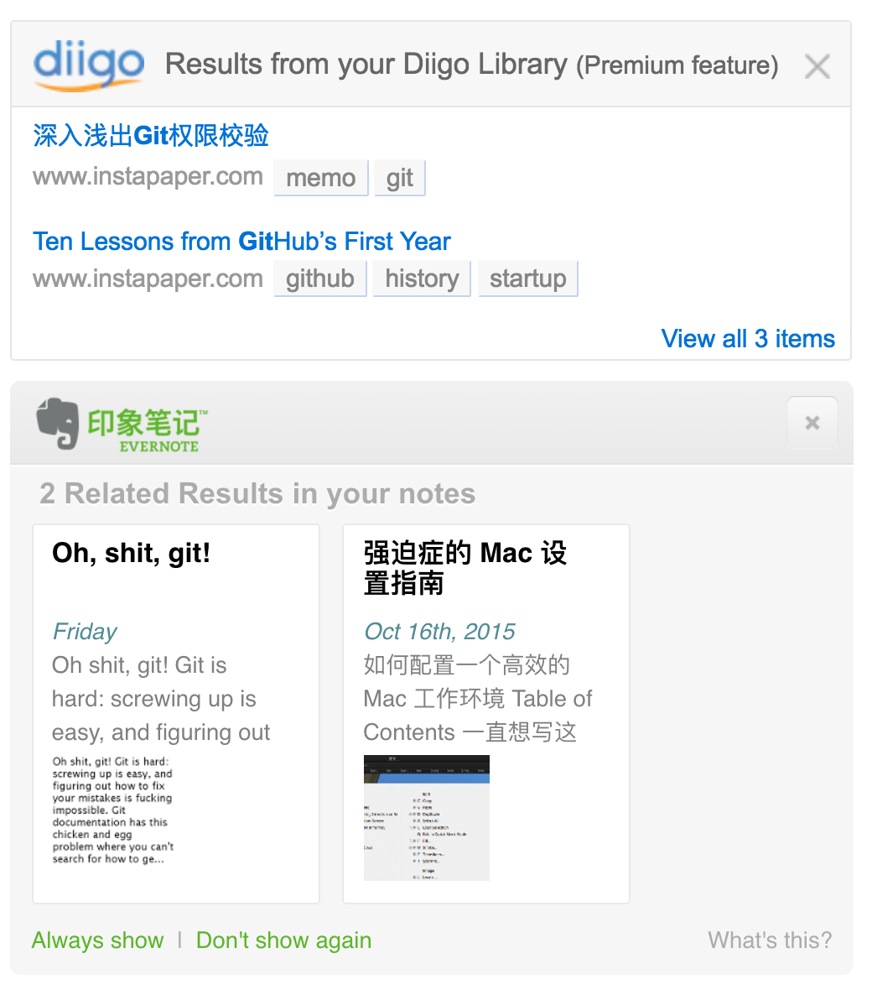

# Meta Learnings: GTD and PKM

最近看了两个文章，一个是 ThoughtWorks 洞见上的[没有了老师，你该如何学习？](http://insights.thoughtworkers.org/how-to-study-without-teacher/)，它提到了四个点，把我散乱的困惑全串起来了：

* 学什么：注重底层原理和高层解决方案的学习，因为它们相对稳定，变动不大；中层变动频繁的知识，项目用什么学什么
* 怎么学：快速反馈、实践、反馈
* 如何执行：GTD：收集、分类、计划、执行、反馈总结
* 广度：PKM

这解决了我一个长期的困惑，明白了要学习什么，定出了一个短期的目标，终于决定准备好了可以找熊节来聊 sponsor 的事情。目标制定出来了，也落实到长期、中期和短期的计划了，怎么解决执行的问题呢？总结了一下，原则十分简单：

* 2分钟内能做完的事马上做
* 1天内能做完的事记录下来，当天完成
* 短期目标，细化到 calendar 中，制定成 task 加以跟踪，使用番茄工作法辅助执行
* 中期目标，利用“21天习惯”原理，细化成每天重复任务，分解成短期任务加以实现
* 长期目标，使用“愿望清单”法进行管理，进一步拆分成中期和短期目标加以跟踪和执行

## PKM：高效的知识管理

PKM 是较早解决的一个问题，它主要目标是利用有限的时间，以尽可能低的成本筛选出价值高的信息并转化成知识，以达到高效学习的目的。这里价值如何算高，因人和时期而异，但如何以尽可能低的成本，在互联网茫茫的信息之网中筛选出高价值的信息，并转化成知识呢？

### 筛选

筛选信息有一个过程，它基本与 GTD 遵循一个类似的过程，即搜集、归类、计划的过程。首先我们希望有一个集中的地点获取所有的信息，并实现对它们的自动归类（通过 label/tag 系统）；其次通过每天小量固定时间的粗阅读，快速进一步筛出自己觉得“有价值”的信息，转存到另一个地点；最后是细阅读的阶段。综上，这两个阶段，我们分别是通过两个工具来辅助实现：

* 信息搜集：Feedly/Reeder/Gmail
* 细阅读：Instapaper/Pocket

### 信息 -> 知识

最后进入到细阅读阶段的知识，有更大的可能是对自己有益的信息。那么，如何将这些信息尽可能多地转化成成体系的知识呢？这里就不得不提到吕立青的一个点：标注胜于收藏。高效学习的方法，永远是**带着问题阅读**、**实践与快速反馈**、**整理成体系**，而不是一键收藏然后再也不会打开这个书签或者网页。基于此主动阅读标注的学习方法，我们同时也需要一个工具来进行标注、归类、整理体系化的知识。综上，目前我用到的工具有两个：

* diigo，用于标注，其 outliner 完美结合了带着问题阅读 -> 整理成体系这样的学习路径
* evernote，用于归档部分技术知识，仅用于存档

diigo 和 evernote 还能将资料库中相关的内容显示在 Google 搜索的侧边栏，从而让你优先浏览已经阅读、归档、整理过的知识，使知识的学习和流通成为闭环。

## GTD：计划与执行的分离

目标和规划有了，PKM 也有了，可以说，[这篇文章](http://www.mifengtd.cn/articles/runningcheese-gtd-system.html)则解决了剩下的唯一一个问题：如何分类任务并执行。前面提到，GTD 的几个核心的步骤为：

* 搜集。工具方面，需要一个可以快速记录、随手可及、可以设定日期、可以可视化任务完成与否、与 calendar 集成的 todo 工具，我用的是[ticktick](https://ticktick.com/)
* 分类、计划。四象限原则、时间资源进行任务裁剪
* 执行。工具方面，需要一个可以将细化后的 task 自动化监督执行的工具，我用的是[pomotodo](https://pomotodo.com/app/)
* 反馈总结。retrospective

总结下来，当已经确定下一个中短期的目标，并且已经将其按四象限原则、时间资源等成本综合考虑进行了裁剪后，要将它们 **细化成 task** 并 **自动化执行** 的步骤为：

1. 将细化后的 task 固定到每天的时段去，并且保证 ticktick 与 calendar 端的**实时**集成
2. pomotodo 实时拉取 calendar 上的任务，并**自动化**地根据时段设定的任务启动 pomo

## 痛点

1. [GTD] 
2. [GTD] Pomotodo 还只能单向推送到 Gmail，无法订阅 Gmail，也就无法自动根据 calendar 上的 task 安排执行 pomos
3. [PKM] IFTTT 上的 evernote channel 没有开放保存全文的 API，一些 memo 类的文章无法从 Instapaper/Evernote 归档到 evernote，只能手动使用 Evernote Web Clipper 插件
4. [GTD] 没有中长期目标的可视化支持。我希望它能在 ticktick 上体现出来：我中长期要做这个事，在短期上体现为哪个时间安排哪个计划。目前短期任务是零散的，而 workaround 也只能是我在这个 README 写下长期目标，通过 Github issue 管理我的中期目标。手动的方式既不灵活，也容易遗漏

## 2016.11 - 2017.7 计划

关于具体的方向，大熊说年轻可以不用纠结，心就定了一些。那么中期的目标，则在邱俊涛的[这篇文章](http://icodeit.org/2015/06/do-we-really-short-for-front-end-developer/)中得到了解答：作为 developer，你要对开发以外的上下游，即整个软件工程的流程都涉足，如此才能更系统地思考问题。

